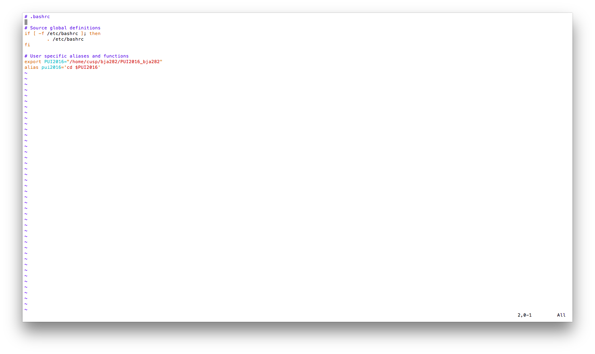

#HW1
###Ben Alpert (bja282)

To complete this assignment, I followed the steps below: 

1. I started by connecting to compute to experiment with declaring variables and aliases. 
2. After successfully declaring variables and aliases, I connected to the .bashrc script by using 'vim ~/.bashrc'. 
3. I added my PUI2016 variable and pui2016 alias to the .bashrc file. (Screenshot below)
4. I then tested the alias 'pui2016', which was successful. (Screenshot below)
5. I went online to github and created a new repository, "PUI2016_bja282". 
6. I then followed the github directions to create a repository on the command line of my local computer.
7. Inside the repository, I created a new directory named "/HW1_bja282"
8. I uploaded the screenshots using the web platform and then began editing this README.md file, using a GitHub markdown cheat sheet for reference: https://github.com/adam-p/markdown-here/wiki/Markdown-Cheatsheet. 
9. Assignment 2 Complete - environment all set up!

Edited '.bashrc' file. 

Proof of function: 'pui2016' alias
